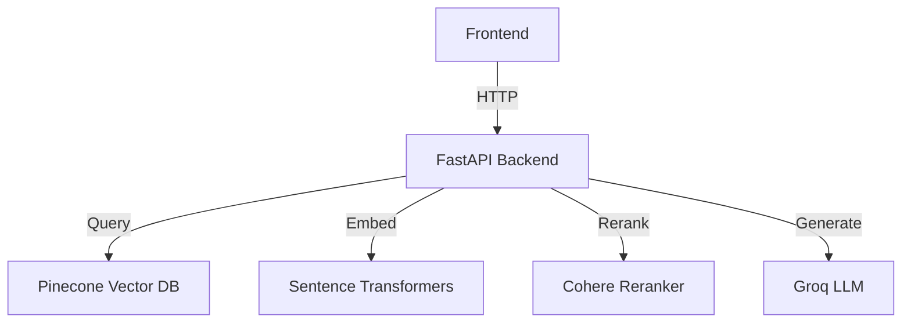

# Predusk RAG Application

A Retrieval-Augmented Generation (RAG) application that allows users to upload documents, process them into chunks, and query them using natural language with proper citation support.

## Features

- **Document Processing**: Upload and process various document formats (PDF, DOCX, TXT, etc.)
- **Vector Storage**: Store document chunks in a Pinecone vector database
- **Semantic Search**: Find relevant document chunks using semantic search
- **Reranking**: Improve search results with Cohere's reranker
- **Citation Support**: Generate answers with proper citations to source documents
- **Web Interface**: Simple and intuitive web interface for document management and chat

## Architecture



## Configuration

Copy `.env.example` to `.env` and fill in your API keys:

```bash
cp .env.example .env
```

### Required Environment Variables

- `GROQ_API_KEY`: Your Groq API key for LLM access
- `PINECONE_API_KEY`: Your Pinecone API key
- `PINECONE_ENVIRONMENT`: Your Pinecone environment (e.g., `us-west1-gcp`)
- `PINECONE_INDEX_NAME`: Name for your Pinecone index (default: `predusk-rag-index`)

### Optional Environment Variables

- `COHERE_API_KEY`: Cohere API key for reranking (highly recommended)
- `GROQ_MODEL`: Groq model to use (default: `llama3-70b-8192`)
- `EMBEDDING_MODEL`: Sentence Transformers model (default: `all-MiniLM-L6-v2`)
- `RERANKER_MODEL`: Cohere reranker model (default: `rerank-english-v2.0`)
- `CHUNK_SIZE`: Number of tokens per chunk (default: `1000`)
- `CHUNK_OVERLAP`: Overlap between chunks (default: `150`)

## Installation

1. Clone the repository:
   ```bash
   git clone https://github.com/yourusername/predusk.git
   cd predusk
   ```

2. Use the provided `predusk_new` virtual environment:
   ```bash
   # On Windows PowerShell:
   . predusk_new\Scripts\Activate.ps1
   # On Windows CMD:
   predusk_new\Scripts\activate.bat
   # On macOS/Linux (if needed):
   source predusk_new/bin/activate
   ```

3. Install dependencies:
   ```bash
   pip install -r requirements.txt
   ```

4. Set up your environment variables in `.env`

## Running the Application

Start the development server:

```bash
uvicorn app.main:app --reload
```

Then open your browser to http://localhost:8000

## Deployment


### Deploying to Vercel (Free Hosting)

This project is ready for serverless deployment on Vercel:

1. Install the [Vercel CLI](https://vercel.com/docs/cli):
   ```bash
   npm install -g vercel
   ```
2. Log in to Vercel:
   ```bash
   vercel login
   ```
3. Deploy:
   ```bash
   vercel --prod
   ```
4. Set your environment variables in the Vercel dashboard (Settings > Environment Variables) using `.env.example` as a reference.

The FastAPI app is exposed as a serverless function via `api/main.py`.

---

You can also deploy to other platforms (Render, Railway, HF Spaces, etc.) that support Python/ASGI applications. See their docs for details.

## Usage

1. **Upload Documents**:
   - Click "Upload Documents" and select one or more files
   - The documents will be processed and stored in the vector database

2. **Chat with Your Documents**:
   - Type your question in the chat input
   - The system will retrieve relevant chunks and generate an answer with citations

3. **View Sources**:
   - Click on citation numbers (e.g., [1]) to view the source text

## Quick Start

1. Clone the repo and set up your environment as above.
2. Add your API keys to `.env` (see `.env.example`).
3. Run locally with `uvicorn app.main:app --reload` or deploy to Vercel.
4. Upload documents and start chatting!

## Architecture Diagram

See the diagram in the Architecture section above (uses Pinecone, Cohere, Groq, FastAPI, etc.).

## Chunking Params, Retriever/Reranker Settings, Providers

- Chunk size, overlap, and model settings are configurable via environment variables (see above).
- Providers used: Pinecone (vector DB), Cohere (reranker), Groq (LLM), Sentence Transformers (embeddings).

## Remarks

- Free hosting providers (like Vercel) may have cold starts, memory, or execution time limits.
- If you hit provider limits (e.g., Pinecone free tier, Cohere rate limits), consider upgrading or switching providers.
- Keep API keys server-side and never commit secrets.

## Performance Considerations

- **Chunk Size**: Larger chunks provide more context but may reduce precision
- **Reranking**: Significantly improves result quality but adds latency
- **Model Selection**: Larger models provide better answers but are slower and more expensive

## Troubleshooting

- **Missing API Keys**: Ensure all required API keys are set in `.env`
- **Pinecone Index**: The first run will create the index if it doesn't exist
- **Document Processing**: Check the logs for any processing errors

## License

MIT
