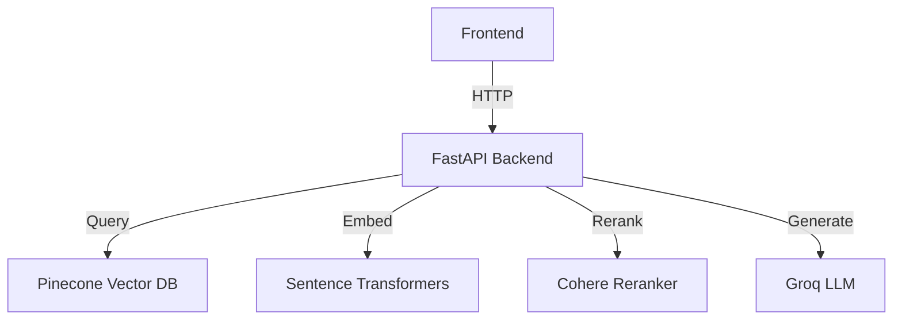

# Predusk RAG Application

A Retrieval-Augmented Generation (RAG) application that allows users to upload documents, process them into chunks, and query them using natural language with proper citation support.

## Features

- **Document Processing**: Upload and process various document formats (PDF, DOCX, TXT, etc.)
- **Vector Storage**: Store document chunks in a Pinecone vector database
- **Semantic Search**: Find relevant document chunks using semantic search
- **Reranking**: Improve search results with Cohere's reranker
- **Citation Support**: Generate answers with proper citations to source documents
- **Web Interface**: Simple and intuitive web interface for document management and chat

## Architecture



## Configuration

Copy `.env.example` to `.env` and fill in your API keys:

```bash
cp .env.example .env
```

### Required Environment Variables

- `GROQ_API_KEY`: Your Groq API key for LLM access
- `PINECONE_API_KEY`: Your Pinecone API key
- `PINECONE_ENVIRONMENT`: Your Pinecone environment (e.g., `us-west1-gcp`)
- `PINECONE_INDEX_NAME`: Name for your Pinecone index (default: `predusk-rag-index`)

### Optional Environment Variables

- `COHERE_API_KEY`: Cohere API key for reranking (highly recommended)
- `GROQ_MODEL`: Groq model to use (default: `llama3-70b-8192`)
- `EMBEDDING_MODEL`: Sentence Transformers model (default: `all-MiniLM-L6-v2`)
- `RERANKER_MODEL`: Cohere reranker model (default: `rerank-english-v2.0`)
- `CHUNK_SIZE`: Number of tokens per chunk (default: `1000`)
- `CHUNK_OVERLAP`: Overlap between chunks (default: `150`)

## Installation

1. Clone the repository:
   ```bash
   git clone https://github.com/yourusername/predusk.git
   cd predusk
   ```

2. Use the provided `predusk_new` virtual environment:
   ```bash
   # On Windows PowerShell:
   . predusk_new\Scripts\Activate.ps1
   # On Windows CMD:
   predusk_new\Scripts\activate.bat
   # On macOS/Linux (if needed):
   source predusk_new/bin/activate
   ```

3. Install dependencies:
   ```bash
   pip install -r requirements.txt
   ```

4. Set up your environment variables in `.env`

## Running the Application

Start the development server:

```bash
uvicorn app.main:app --reload
```

Then open your browser to http://localhost:8000

## Deployment

The application can be deployed to any platform that supports Python/ASGI applications. Here's an example for deploying to Render:

1. Create a new Web Service on Render
2. Connect your GitHub repository
3. Set the following environment variables:
   - `PYTHON_VERSION`: 3.9+
   - `INSTALL_COMMAND`: pip install -r requirements.txt
   - `START_COMMAND`: uvicorn app.main:app --host 0.0.0.0 --port $PORT
4. Add your environment variables from `.env`

## Usage

1. **Upload Documents**:
   - Click "Upload Documents" and select one or more files
   - The documents will be processed and stored in the vector database

2. **Chat with Your Documents**:
   - Type your question in the chat input
   - The system will retrieve relevant chunks and generate an answer with citations

3. **View Sources**:
   - Click on citation numbers (e.g., [1]) to view the source text

## Performance Considerations

- **Chunk Size**: Larger chunks provide more context but may reduce precision
- **Reranking**: Significantly improves result quality but adds latency
- **Model Selection**: Larger models provide better answers but are slower and more expensive

## Troubleshooting

- **Missing API Keys**: Ensure all required API keys are set in `.env`
- **Pinecone Index**: The first run will create the index if it doesn't exist
- **Document Processing**: Check the logs for any processing errors

## License

MIT
